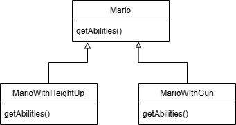
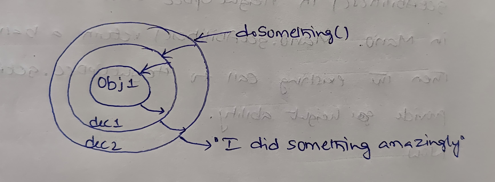
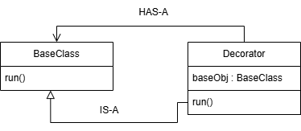
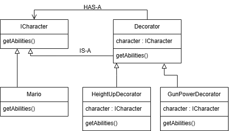
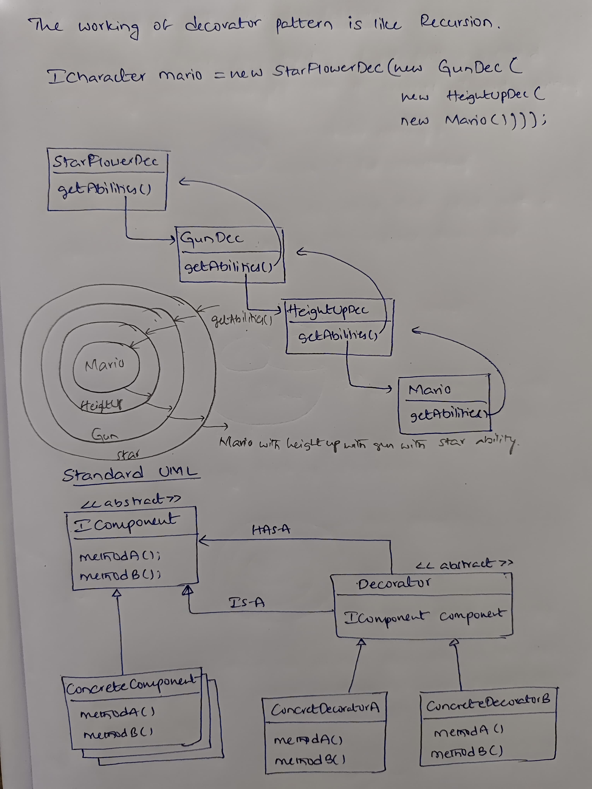

# Decorator Design Pattern
- Provides additional responsibilities to an object at run time  
We can do this with Inheritance

Lets try to understand with Mario game example:  
As game progress, the basic mario's abilities adds up like height up, gun shooting etc.. So mario will have additional responsibilities.  
  
This heiraechy becomes complex. As new abilities comes like flying ability, height up and gun ability, height up and flying ability we need to add Fly class, HeightUpAndGun class, HeightUpAndFly class etc.. Adding more and more classes leads class explosion. This is because Inheritance. Therefore prefer Composition over Inheritance.  

**Mario example with Decorator Pattern:**  
Assume we have an object. If we call a method say doSomething() then it returns "I did something"  
With decorator pattern, we wrap that object with a decorator which enhaces the response from the object  
We can infinitely stack up decorators  
  

We still use Inheritance so that decorator behaves like that object  
We use Composition so that behaviour changes/extends dynamically at run time  
  
So, decorator can call base class run() method also it's own run() method.  

**Mario Example UML**  
  
with this we don't need extra classes like HeightUpAndGun, HeightUpAndFly etc. Let's see how...  
If we want Height up with Gun ability:  
```Character mario = new HieghtUp(new Gun(new Mario()))```  
this will simply creates a mario with height up and with a gun :)  
This way we eliminate extra classes  

The working of decorator pattern is like Recursion  
See below the working and **Standard UML** for Decoration design pattern  
  


