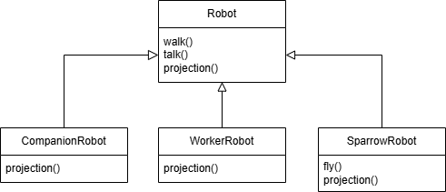
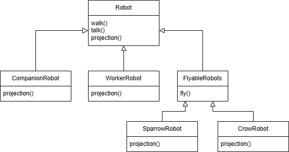

# Strategy Design Pattern  
**This pattern says Inheritance is bad**  

For an example, we are building an app for Robot simulation in which different kind of robots walk, talk etc..  

Lets add another robot called **SparrowRobot** which can *fly*  
  
Assume we have some number of robots which can fly  
So for each robot we have to fly() method. Clearly there is no resuability of fly() methpd which is exacly same for all flyable robots like SparrowRobot, CrowRobot etc..  
If we keep fly() method in Robot class itself then all non-flyable robots will also fly.  

Therefore we introduce new interface which deals with flyable robots  
  
Lets assume we have new kind of robots which use Jets to fly. All these Jet robots needs to overwrite the fly() method. Instead we introduce new interfaces called FlyWithWings and FlyWithJet  
<imag src="images/robots-heirarchy.jpg" />  
Now we have brand new kind of robots which can't talk etc.
Observe the heirarchy from our discussion above. This becomes complex with as new kind of robots comes  

**The solution to inheritance is not more inheritance**  
The solution is Strategy Pattern.  
**Definition: Defines a family of algorithm, put them into separate classes so that they can be changed at run time**

