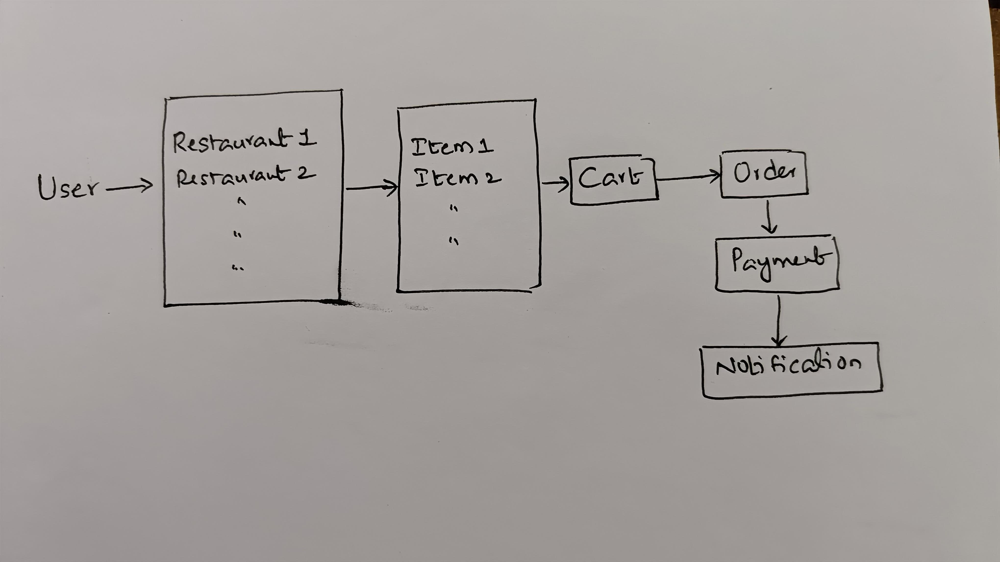

# Food Delivery App Low Level Design
## Functional Requirements
1. User can search for restaurants based on Location
2. User can add items to Cart
3. User can check out by making Payment
4. User should be notified once the order placed successfully

## Non-functional Requirements
1. Each Part of design should be scalable and modifiable

## Happy flow
Food delivery app has two parts 
1. User Point of view
2. Delivery Partner Point of view

in this design we focus only on User point of view which something looks likes below
 

what this flow says is USER upon opening the platform would see some restaurants and Selects one of them and checks the items avaliable and adds the items to the cart.

There will be two type of orders in our design 
1. Delivery - door-step delivery by delivery partner
2. Pick up - user himself comes to the restaurant and pick ups the food

Then user selects payment method (UPI, Credit card, Net banking etc..)
user will get a notification after placing the order
